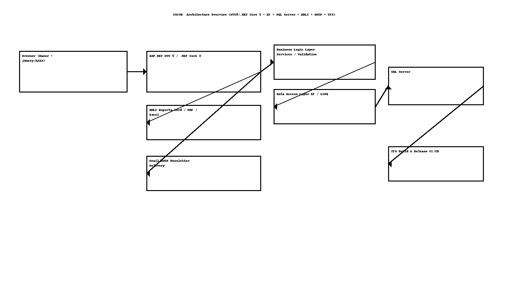

# CSIWB — High‑Level Design (HLD)

> **Author:** Sagarika Chakraborty — Full Stack .NET Engineer | React.js | Web API | SQL Server

## 1) Overview & Scope
Membership platform for **CSIWB** to manage:
- **Associate Life Membership** registration & profile management.
- **Active vs Expired** status lifecycle with renewal/grace rules.
- **Newsletter** distribution & subscription preferences.
- **Reports** (Word/PDF/Excel) via RDLC for rosters, expiries, engagement.
- Admin console for roles/chapters/communications.

## 2) Goals & NFRs
- **Security**: AuthN/Z, HTTPS, CSRF tokens, input validation, audit trails.
- **Reliability**: Transactional updates, idempotent newsletter sends (batching), retry/backoff.
- **Performance**: EF/LINQ optimizations, paging & server-side filtering, caching hot lists.
- **Scalability**: Stateless controllers; DB indexing; optional SMTP/queue for mail bursts.
- **Maintainability**: 3‑layer design (BLL/DAL/Models); repository pattern; modular controllers.
- **Observability**: Structured logs, delivery logs, error monitoring.

## 3) Architecture


```mermaid
flowchart LR
  A[Browser (Razor + jQuery/AJAX)] --> B[ASP.NET MVC 5 / .NET Core 3 Controllers]
  B --> C[BLL (Services, Validation)]
  C --> D[DAL (EF Repositories)]
  D --> E[(SQL Server)]
  B --> F[RDLC Reports]
  B --> G[Email/SMTP (Newsletter)]
  B --> H[TFS Build & Release]
```

## 4) Core Modules
- **Members**: registration, profile, documents, chapter mapping.
- **Lifecycle**: active/expired, renewal & grace, verification workflows.
- **Newsletters**: list management, templates, send logs.
- **Reporting**: membership roster, expiries by month, activity/engagement.
- **Admin**: roles/permissions, chapter admin, audit exports.

## 5) Key Flows (Happy Paths)
1. **Register Member** → validate → persist → status **Active**; audit logged.
2. **Expiration** → scheduled job flags **Expired**; member notified; renewal link provided.
3. **Newsletter** → build audience from filters → send → store delivery logs & bounces.
4. **Reports** → run RDLC → export to PDF/Word/Excel.

## 6) Security & Compliance
- ASP.NET Identity/Forms auth; role claims (Admin, ChapterAdmin, Member).
- Anti‑forgery tokens; size/type checks for uploads; PII minimization.
- SMTP credentials secured; unsubscribe compliance (per‑member flags).

## 7) Availability & DR
- Regular DB backups & PITR.
- Staged deployments via TFS with transforms; smoke tests; rollback playbook.

## 8) CI/CD
- TFS pipeline: restore → build → test → package → deploy.
- Environments: Dev/QA/Prod with config per environment.
