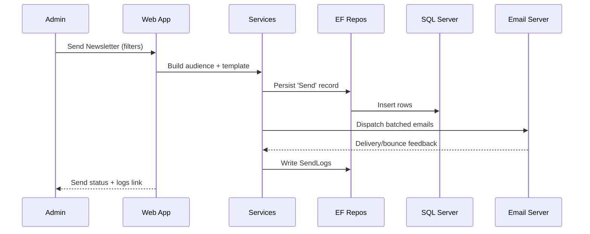

# CSIWB — Low‑Level Design (LLD)

> **Author:** Sagarika Chakraborty — Full Stack .NET Engineer | React.js | Web API | SQL Server

## 1) Solution Layout (3‑Layer)
- **CSIWB.Web** — MVC 5 / .NET Core 3 (Controllers, Views/Razor, Filters, Bundles)
- **CSIWB.BLL** — Services (Members, Lifecycle, Newsletter, Reports), Validators
- **CSIWB.DAL** — EF DbContext, Repositories, Migrations/SQL Scripts
- **CSIWB.Models** — Entities, DTOs/ViewModels
- **Reports/** — RDLC templates (Roster, Expiries, Engagement)
- **Tests/** — Unit tests for services and repositories

## 2) Controllers & Actions (samples)
### MembersController
- `Register()` GET/POST — onboarding
- `Profile(id)` — view/update
- `Renew(id)` — renew membership (if allowed)

### LifecycleController
- `ExpireScanner()` — scheduled job endpoint/agent
- `Renewals()` — due/overdue lists

### NewsletterController
- `Templates()` — CRUD templates
- `Send()` — audience filters + dispatch
- `Logs(page,size)` — delivery & bounce logs
- `Unsubscribe(token)` — one‑click opt‑out

### ReportsController
- `Roster()` — member list by chapter/status (RDLC export)
- `Expiries()` — upcoming expiries
- `Engagement()` — opens/clicks (if tracked)

## 3) DTOs (examples)
```json
// MemberRegisterRequest
{
  "name": "Dr. A. Sen",
  "email": "asen@csiwb.org",
  "phone": "+91-9xxxxxxxxx",
  "chapterId": 7,
  "membershipType": "AssociateLife"
}

// NewsletterSendRequest
{
  "templateId": 12,
  "filters": { "chapterId": 7, "status": "Active" },
  "testOnly": false
}
```

## 4) Validation & Rules
- Unique email/phone; chapter must exist.
- Lifecycle: renewal allowed only within policy windows.
- Newsletter: hard unsubscribe enforced; rate limit dispatch; retry on SMTP error.

## 5) Persistence (ER Overview)
**Tables**
- `Members(id, name, email, phone, address, chapterId, type, status, joinedAt, expiresAt)`
- `Chapters(id, name, city, state)`
- `Newsletters(id, name, templateHtml, createdAt)`
- `Sends(id, newsletterId, sentAt, audienceJson, count, status)`
- `SendLogs(id, sendId, memberId, status, detail, at)`

Indexes: `Members(chapterId, status)`, `Sends(sentAt)`, `SendLogs(sendId, at)`.

## 6) Sequences


## 7) Error Handling
- `400` validation (field map for AJAX)
- `401/403` auth/authorization
- `404` not found
- `409` invalid lifecycle transition/duplicate send
- `5xx` generic failure (correlation id returned)

## 8) Performance
- EF Include/ThenInclude; indexes; server‑side paging
- Caching for chapter lists & common filters
- Batched SMTP sends and backoff on throttling

## 9) CI/CD (TFS)
- Build → test → package → deploy per environment
- Config transforms; DB migrations
- Rollback via last successful artifact; DB restore SOP
